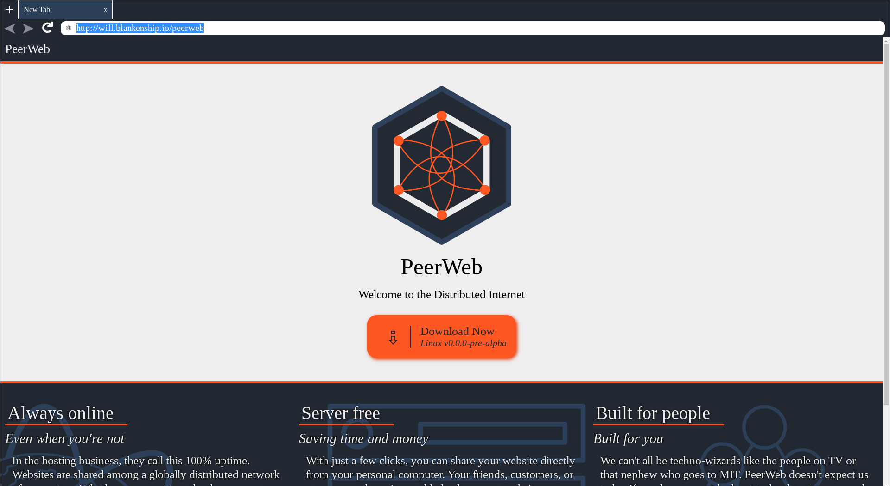

Getting Started
===============

This document will walk you through getting up and running with PeerWeb during it's early alpha release. Things will be changing fast, but an effort will be made to keep this document up-to-date.

# Requirements

We don't yet have a build of PeerWeb available for download. Luckily, there is no build step for running this locally, but you still will need `git` to clone the PeerWeb repository and the `nodejs` platform.

Installation requirements:

1. [nodejs and npm](https://nodejs.org/en/download)
2. [git](https://git-scm.com/book/en/v2/Getting-Started-Installing-Git)

# Installation

Installation currently involves cloning the PeerWeb repository with `git`, using `npm` to install PeerWeb's dependencies, and then running `npm start`.

```text
$ git clone https://github.com/retrohacker/peerweb.git
$ cd peerweb
$ NODE_ENV=DEV npm install
$ npm start
```

From now on, from the `peerweb` directory, you can simply run `npm start` to start the browser.

Moving forward, we will provide pre-built binaries for Windows, OSX, and various Linux distributions.

# Unboxing Experience.

When you first run the browser, you should be presented with the following UI:



This UI has many shortcomings compared to other web browsers, I encourage you to open up [issues](https://github.com/retrohacker/peerweb/issues) with suggestions on how we can make the best first impression with this browser.

# Sharing your own website

While the browser currently can handle loading content from a torrent, there is not yet a way to share your own content through the UI. This is on the roadmap and is being tracked in [issue #5](https://github.com/retrohacker/issues/5).

## Ports

Every router and network is a special little snowflake. The main thing here is NAT, and making sure that incomming connections make it to the bittorrent client they were destined for. NAT traversal is on the roadmap, but is no easy path to walk.

For now, in order to use Bittorrent's DHT protocol, you will need to use a computer that receives all incomming traffic on the network. This is easiest on something like Digital Ocean.

## Webtorrent

To share your website, follow these steps.

```
$ npm install -g webtorrent-cli
$ webtorrent seed [website_folder]
```

This will show your your torrent hash. It will look something like: `000260db64bc4d57afb5458639f2364d628b6e1b`

You can then take this hash and use it as a url in peerweb: [peer://000260db64bc4d57afb5458639f2364d628b6e1b](peer://000260db64bc4d57afb5458639f2364d628b6e1b)
